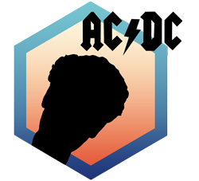

<!-- README.md is generated from README.Rmd. Please edit that file and click on Knit button at the end. -->

# t3 package <a href='https://ob7-ird.github.io/acdc'></a>

<!-- badges: start -->

[](https://www.tidyverse.org/lifecycle/#experimental)
[](https://github.com/OB7-IRD/acdc/actions)
[](https://CRAN.R-project.org/package=acdc)
<!-- badges: end -->

***Automatic Compliance for Data Calls***

## Warning

Package and documentation still in construction !

## Overview

This R package provides processes for supporting data calls productions.
These processes go through extractions and links from Ob7 databases,
quality controls, descriptive analysis and data design.

## Installation

``` r
devtools::install_github("https://github.com/OB7-IRD/acdc",
                         INSTALL_opts=c("--no-multiarch"))
```

### Development version

To get a bug fix or to use a feature from the development version, you
can install the development version of t3 from GitHub.

``` r
devtools::install_github("https://github.com/OB7-IRD/acdc",
                         ref = "development",
                         INSTALL_opts=c("--no-multiarch"))
```

## Cheatsheet

Working in progress for this section. Be patient.

## Usage

``` r
library(acdc)
# Next steps example will be added later
```

## Getting help

If you encounter a clear bug, please file an issue with a minimal
reproducible example on [GitHub issues
page](https://github.com/OB7-IRD/acdc/issues). This link is also
available if you have any questions and improvement propositions.

## References

Working in progress for this section.
